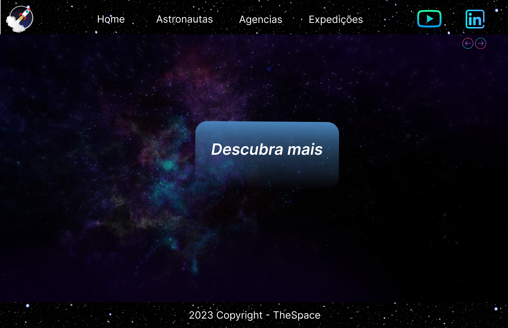

# TheSpace

---

### Sobre esse site:

Esse site do tipo empresarial foi desenvolvido tendo o principal objetivo colocar em prática os conhecimentos adqueridos durante o curso de front-end no decorrer dos 10 meses de aula.

---
### Tecnologias utilizadas

- HTML
- CSS
- JAVASCRIPT
- RESPONSIVIDADE
- MARKDOWN
- ACESIBILIDADE
---

### Diferencial do projeto

Nesse projeto foi desenvolvido usado rotas para aumentar a eficiencia no carregamento da página, e foi desenvolvidos componentes para ser usado pelo javascript. 

---

<h2>Critérios de avaliação</h2>

- [F]  Documentou problemas, se encontrado, para futuras consultas?
- [T]  Foi criado o layout no figma?
- [T]  A página foi construída seguindo o planejado no Figma?
- [T]  A página funciona em dispositivos diferentes?
- [T]  Foi consumida a API escolhida?
- [T]  Foi criado web componentes?
- [T]  Foi criado um padrão de roteamente para as paginas?
- [T]  As funções foram criadas seguindo à boa prática de responsabilidade única?
- [T]  Quando possível, foi criado funções puras?
- [T]  O projeto está publicado?
- [T]  Foi criado o arquivo README.md?

---
## AUTOR

- [Gustavo Henrique](https://github.com/GustavoHenriqueProjects)
- [Figma](https://www.figma.com/file/WSqR34kePsAVhFj7WXl9c5/The-Space?type=design&node-id=1%3A5&t=MRdHrJUuQQcKKzye-1
) 

